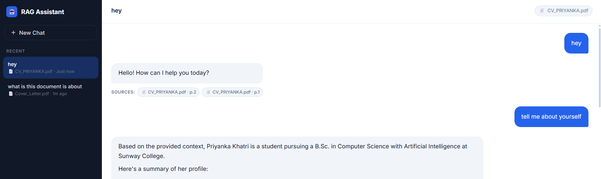

# Build Your Own RAG Chatbot

A Retrieval-Augmented Generation (RAG) chatbot that allows users to upload their own PDF and ask questions about its content.

Built with **React** for the frontend and **FastAPI** for the backend, using **LangChain, Google Gemini, and FAISS** for the RAG pipeline.



## Features

* Upload and chat with any PDF through the web interface
* Extract, chunk, embed, and retrieve document content
* Handle structured PDF content such as tables
* Provide grounded answers and respond with "I don't know" when information is not supported by the document
* Stream responses progressively
* Display document and page-number citations
* Maintain conversation history for contextual follow-up questions
* Support implicit references and pronouns in follow-up questions
* Separate React frontend and FastAPI backend

## Assignment Implementation

### Level 1 — Bring Your Own PDF

Users can upload a PDF directly through the application without changing filenames or source code.

The uploaded document is processed through:

```text
PDF → Extraction → Chunking → Embeddings → FAISS → Retrieval → Answer
```

Questions outside the document are handled with an appropriate "I don't know" response.

Different chunking configurations were tested. The current configuration uses:

```text
Chunk size: 1000
Chunk overlap: 150
```

This configuration provided good retrieval performance and sufficient context for answering questions.

### Level 2 — Handle Messy PDFs

The chatbot was tested with structured PDF content, including tables and non-trivial layouts.

PDF extraction was improved to preserve useful structured information and enable retrieval of answers from table-based content.

### Level 3 — Streaming

Responses are streamed progressively from the backend to the frontend, allowing users to see the answer as it is generated rather than waiting for the complete response.

### Level 4 — Citations

Retrieved chunks retain document metadata, allowing the chatbot to display the document name and relevant page numbers used to generate the answer.

Example:

```text
Sources:
Academic Regulations 2025-26.pdf — Page 32
```

### Level 5 — Conversational RAG

Conversation history is maintained across messages so the chatbot can understand follow-up questions and implicit references.

Example:

```text
User: What are the progression requirements?

Assistant: ...

User: What happens if I don't meet them?

Assistant: ...
```

The chatbot uses the previous conversation to resolve references such as "they", "them", "it", and "this".

### Level 6 — Real Application

The RAG chatbot is implemented as a separate frontend and backend application.

* **Frontend:** React + Vite
* **Backend:** FastAPI + Uvicorn
* **RAG:** LangChain + FAISS + Google Gemini

The complete system can be accessed through a web browser rather than a notebook.

## RAG Pipeline

```text
PDF Upload
    ↓
PDF Extraction
    ↓
Chunking
    ↓
Embeddings
    ↓
FAISS Vector Store
    ↓
Relevant Context
    ↓
Google Gemini
    ↓
Streaming Answer + Citations
```

## Project Structure

```text
university-rag-based-assistant/
│
├── backend/
│   ├── main.py
│   ├── requirements.txt
│   └── rag/
│       ├── __init__.py
│       ├── chain.py
│       ├── embeddings.py
│       ├── loader.py
│       ├── retriever.py
│       ├── splitter.py
│       └── vectorstore.py
│
├── frontend/
│   ├── public/
│   ├── src/
│   ├── package.json
│   └── vite.config.js
│
├── data/
│
├── .gitignore
└── README.md
```

Uploaded PDFs, `.env` files, virtual environments, and generated files are excluded from Git.

## Running Locally

### Backend

```powershell
cd backend

python -m venv venv
.\venv\Scripts\Activate.ps1

pip install -r requirements.txt
```

Create `backend/.env`:

```env
GEMINI_API_KEY=your_api_key_here
```

Run the backend:

```powershell
uvicorn main:app --reload
```

### Frontend

```powershell
cd frontend

npm install
npm run dev
```

Open the URL provided by Vite and upload a PDF to start chatting.

## Testing

The chatbot was tested with:

* Questions answered directly by the uploaded document
* Questions outside the document
* Table-based questions
* Different chunking configurations
* Streaming responses
* Source and page citations
* Follow-up questions using conversation history and implicit references

## What Surprised Me

Retrieval quality depends strongly on **PDF extraction and chunking**. Even small changes to how a document is extracted or divided into chunks can affect which information is retrieved and the quality of the final answer.

## Assignment Completion

**Levels 1–6 completed.**

Level 6 is implemented as a bonus through the separate **React frontend and FastAPI backend**.
